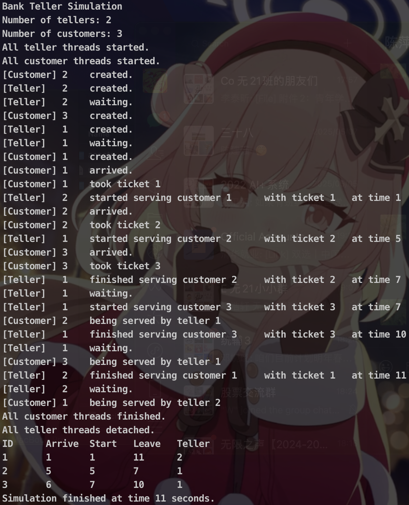
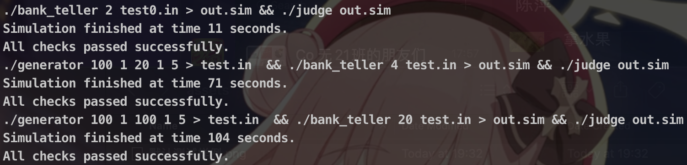

## 实验 1：进程间同步/互斥问题 —— 银行柜员服务问题

[TOC]


### 问题描述

理发店里有一位理发师，一把理发椅和 N 把供等候理发的顾客坐的椅子。如果没有顾客，则理发师便在理发椅上睡觉。当一个顾客到来时，他必须先唤醒理发师。如果顾客到来时理发师正在理发，则如果有空椅子，可坐下来等；否则离开。请编程解决该问题。

### 实验环境

本实验在 `aarch64` 平台的 `Ubuntu 24.04 LTS` 操作系统上进行，编程语言采用 `C++ 17`，构建工具采用 `GNU Make 4.3`。

### 实验原理

实验采用信号量 `semaphore` 的 P、V 操作，以实现不同线程间的同步和资源访问的互斥。

`C++17` 提供了一系列与线程同步和互斥相关的标准库类和函数，例如 `std::thread` 用于创建和管理线程，`std::mutex` 用于实现线程间的互斥操作。这些标准库在一定程度上封装了 POSIX 线程库（`pthread`）的功能。

需要注意的是，`sem_t` 属于 POSIX 信号量类型，并不属于 C++ 标准库的一部分，因此使用时需要包含 `<semaphore.h>`，并视平台支持情况使用。在本实验中，将使用 `std::thread` 和 `std::mutex` 实现线程的创建与互斥控制，结合 POSIX 提供的 `sem_t` 信号量进行线程间的同步操作。

### 算法设计

顾客线程与柜员线程的伪代码如下。`mutex` 用于互斥操作，`sem_t` 信号量用于同步操作。需要互斥量的操作包括顾客取号，柜员叫号，对同一个队列操作。需要同步信号量的操作包括顾客取号后通知柜员 `sem_ticket`，完成服务后通知顾客 `c.sem`

```c++
void customer_thread(Customer &c) {
    sleep(c.arrive);
    lock(mutex)                 // 防止不同的顾客取同一个号、防止同时对 queue 操作
    c.ticket = ticket++;
  	queue.push(&c);
    unlock(mutex)
    V(sem_ticket);              // 顾客取号后同步柜台
    P(c.sem);                   // 等待柜台完成服务
}

void teller_thread(Teller &t) {
    while (1) {
        P(sem_ticket);          // 等待顾客取号
        lock(mutex)             // 防止不同的柜台叫同一个号、防止同时对 queue 操作
        c = queue.front(); queue.pop();
        unlock(mutex);
        c.id = t.id;
        c.start = get_time();
        sleep(c.service);
        c.leave = get_time();
        sem_post(c.sem);        // 完成服务后同步顾客
    }
}
```

### 关键代码

#### 数据结构

1. 顾客

   ```c++
   struct Customer {
       int id;         // 顾客序号
       int arrive;     // 到达时间
       int service;    // 服务时长
       int ticket;     // 取号号码
       int teller_id;  // 服务柜台
       int start;      // 开始服务时间
       int leave;      // 离开时间
       sem_t sem;      // 信号量
   };
   ```

2. 柜员用 `id` 唯一标识身份

3. 顾客列表 `std::vector<Customer> customers`，取号后等待的顾客队列 `std::queue<Customer*> ticket_queue`，当前取号号码 `int cust_ticket;`

#### 线程管理

`C++ 17` 提供了 `std::thread` 类，用于管理线程。通过 `join` 操作等待所有顾客线程执行完毕。通过 `detach` 操作在所有顾客服务完毕后分离柜员线程

```c++
for (auto &t : cust_threads) t.join();
DEBUG_PRINT("All customer threads finished.");
for (auto &t : tell_threads) t.detach();
DEBUG_PRINT("All teller threads detached.");
```

#### 计时器

定义 `Timer` 类，用于获取当前时间（距仿真开始），或使线程等待

```c++
class Timer {
public:
    using time_unit = std::chrono::milliseconds;
    using time_t = typename time_unit::rep;
    using Clock = std::chrono::system_clock;

    Timer(int time_zoom) : t0(_raw_time()), time_zoom(time_zoom) {}
    int get_time() {
        return static_cast<int>(std::round(static_cast<double>(_get_time()) / time_zoom));
    }
    void sleep(int seconds) {
        std::this_thread::sleep_for(time_unit(seconds * time_zoom));
    }

private:
    static time_t _raw_time() {
        return std::chrono::duration_cast<time_unit>(Clock::now().time_since_epoch()).count();
    }
    time_t _get_time() {
        return _raw_time() - t0;
    }
    time_t t0;
    int time_zoom;
};
```

其中，`time_zoom` 定义了仿真时间单位，在本实验中可取 100ms

#### 算法实现

1. 顾客线程如下

   ```c++
   void customer_thread(Customer &c) {
       DEBUG_PRINT("[Customer] " << c.id << " \t" << "created.");
       timer.sleep(c.arrive);
       DEBUG_PRINT("[Customer] " << c.id << " \t" << "arrived.");
       {
           std::lock_guard<std::mutex> lk(mutex_ticket);
           c.ticket = cust_ticket++;
         	ticket_queue.push(&c);
       }
       DEBUG_PRINT("[Customer] " << c.id << " \t" << "took ticket " << c.ticket);
       sem_post(&sem_customer);
       sem_wait(&c.sem);
       DEBUG_PRINT("[Customer] " << c.id << " \t" << "being served by teller " << c.teller_id);
   }
   ```

   其中，互斥量（`std::mutex`）配合 `std::lock_guard<std::mutex>` 使用，将其放在花括号 `{}` 代码块中，限制了锁的作用域，确保互斥锁只在需要的最小范围内持有，一旦超出这个范围就自动释放

   此外，在调试模型下程序会打印线程创建、顾客到达、顾客取号、完成服务等一系列事件

2. 柜员线程如下

   ```c++
   void teller_thread(int id) {
       DEBUG_PRINT("[Teller]   " << id << " \t" << "created.");
       while (true) {
           DEBUG_PRINT("[Teller]   " << id << " \t" << "waiting.");
           sem_wait(&sem_customer);
           Customer* c;
           {
               std::lock_guard<std::mutex> lk(mutex_ticket);
               c = ticket_queue.front();
               ticket_queue.pop();
           }
           c->teller_id = id;
           c->start = timer.get_time();
           DEBUG_PRINT("[Teller]   " << id << " \t" << "started serving customer " << c->id << " \t" << "with ticket " << c->ticket << " \t" << "at time " << c->start);
           timer.sleep(c->service);
           c->leave = timer.get_time();
           DEBUG_PRINT("[Teller]   " << id << " \t" << "finished serving customer " << c->id << " \t" << "with ticket " << c->ticket << " \t" << "at time " << c->leave);
           sem_post(&c->sem);
       }
   }
   ```

   其中，互斥量（`std::mutex`）的使用同顾客线程。在调试模型下程序会打印线程创建、柜员等待、开始服务、完成服务等一系列事件

#### 打印调试

定义宏 `DEBUG_PRINT(x)` 用于在 debug 模式下打印详细运行信息，同时利用互斥锁保证多线程下输出不串行

```c++
#ifdef DEBUG
std::mutex mutex_debug;
#define DEBUG_PRINT(x) \
    do { std::lock_guard<std::mutex> lk(mutex_debug); std::cout << x << std::endl; } while(0)
#else
#define DEBUG_PRINT(x) do {} while(0)
#endif
```

### 测试用例

1. 默认样例

   ```c++
   1 1 10
   2 5 2
   3 6 3
   ```

   记录第一个字段是顾客序号，第二字段为顾客进入银行的时间，第三字段是顾客需要服务的时间。该测试样例位于 `test0.in`，运行 `./bank_teller 2 test0.in > out.sim` 运行仿真程序

2. 随机生成的样例：代码参见 `generator.cpp`，顾客达到时间与服务时间服从一定范围内的均匀分布。支持指定顾客个数、分布范围。部分代码如下：

   ```c++
    std::mt19937 rng(std::random_device{}());
    std::uniform_int_distribution<int> arr(min_arr, max_arr);
    std::uniform_int_distribution<int> svc(min_svc, max_svc);
    for (std::size_t i = 1; i <= num_cust; ++i) {
        std::cout << i << " " << arr(rng) << " " << svc(rng) << "\n";
    }
   ```

   用法：

   ```bash
   ./generator <num_cust> <min_arrival_time> <max_arrival_time> <min_service_time> <max_service_time>
   ```

   - 运行 `./generator 100 1 20 1 5 > test.in  && ./bank_teller 4 test.in > out.sim` 生成测试样例并运行仿真程序。该测试样例模拟顾客多、柜员少的拥挤情况
   - 运行 `./generator 100 1 100 1 5 > test.in  && ./bank_teller 20 test.in > out.sim` 生成测试样例并运行仿真程序。该测试样例模拟顾客少、柜员多的稀疏情况

### 测试运行

#### 仿真结果正确性判断

- 检查是否有顾客被多个柜台服务

  ```c++
  std::map<int, int> cust_to_teller;
  for (auto &x : results) {
      auto it = cust_to_teller.find(x.id);
      if (it == cust_to_teller.end()) {
          cust_to_teller[x.id] = x.teller_id;
      } else if (it->second != x.teller_id) {
          std::cout << "ERROR: Customer " << x.id
                    << " served by teller " << it->second
                    << " and teller " << x.teller_id << "\n";
          return 0;
      }
  }
  ```

- 检查是否有柜员同时服务多个顾客

  ```c++
  std::map<int, std::vector<Result>> by_teller;
  for (auto &x : results) {
      by_teller[x.teller_id].push_back(x);
  }
  for (auto &pair : by_teller) {
      auto &vec = pair.second;
      std::sort(vec.begin(), vec.end(), [](auto &a, auto &b){ return a.start < b.start; });
      for (std::size_t i = 1; i < vec.size(); ++i) {
          if (vec[i].start < vec[i-1].leave) {
              std::cout << "ERROR: Teller " << pair.first
                        << " overlaps serving customer " << vec[i-1].id
                        << " (ends at " << vec[i-1].leave << ") and customer "
                        << vec[i].id << " (starts at " << vec[i].start << ")\n";
              return 0;
          }
      }
  }
  ```

- 检查是否存在柜员空闲但顾客等待的情况

  ```c++
  std::map<int, std::vector<std::pair<int,int>>> intervals;
  for (auto &x : results) {
      intervals[x.teller_id].emplace_back(x.start, x.leave);
  }
  for (auto &p : intervals) {
      std::sort(p.second.begin(), p.second.end());
  }
  for (auto &x : results) {
      if (x.start == x.arrive) continue;  // 立即被服务，无等待
      bool found_idle = false;
      int idle_teller = -1;
      for (auto &p : intervals) {
          int t_id = p.first;
          auto &iv = p.second;
          auto it = std::upper_bound(iv.begin(), iv.end(), std::make_pair(x.arrive, INT_MAX));
          bool busy = false;
          if (it != iv.begin()) {
              auto prev = std::prev(it);
              if (prev->second == it->first || x.start <= prev->second) {
                  busy = true;  // 柜员无空闲，或在柜员空闲前（含）已被服务
              }
          }
          if (!busy) {
              found_idle = true;
              idle_teller = t_id;
              break;
          }
      }
      if (found_idle) {
          std::cout << "ERROR: Customer " << x.id
                      << " waited from " << x.arrive << " to " << x.start
                      << " while teller " << idle_teller << " was idle at " << x.start << "\n";
          return 0;
      }
  }
  ```

以上代码位于 `judge.cpp`，用法：

```bash
./judge <input_file>
```

#### 测试运行

运行 `make` 即可完成编译、生成测试样例、仿真运行、正确性判断。运行 `make debug` 可运行默认测试样例并得到详细输出信息

1. DEBUG 模型下运行默认测试样例

   

   可见，程序的 LOG 详细且正确地展示了柜员等待、顾客到达，顾客取号，柜员叫号，柜员完成服务，顾客离开的过程，以及线程的创建，如

   ```c++
   [Teller]   2 	created.        // 柜员 2 线程创建
   [Customer] 1 	created.        // 顾客 1 线程创建
   [Teller]   2 	waiting.        // 柜员 2 等待
   [Customer] 1 	arrived.        // 顾客 1 到达
   [Customer] 1 	took ticket 1   // 顾客 1 取号
   [Teller]   2 	started serving customer 1 	with ticket 1 	at time 1       // 柜员 2 开始服务顾客 1
   [Teller]   2 	finished serving customer 1 	with ticket 1 	at time 11  // 柜员 2 完成服务顾客 1
   [Customer] 1 	being served by teller 2  // 顾客 1 离开
   ```

   最终输出为

   ```csv
   ID	Arrive	Start	Leave	Teller
   1	1	1	11	1
   2	5	5	7	2
   3	6	7	10	2
   ```

   与预期一致

2. 运行默认测试样例、随机生成的样例并验证准确性

   

   可见，均通过了测试，验证了代码的准确性

   观察仿真完成时间，对随机生成的样例 2，耗时 71 个单位时间，但根据生成测试样例的条件（见测试用例章节），顾客在 20 个单位时间内全部达到。这说明大量的顾客在等待。符合预期。某次运行的完整输入见 `test.in.1.bak`，输出见 `out.sim.1.bak`

   对随机生成的样例 3，耗时 104 个单位时间，根据生成测试样例的条件（见测试用例章节），顾客在 100 个单位时间内全部达到。这说明顾客几乎没有等待即可得到服务。符合预期。某次运行的完整输入见 `test.in.2.bak`，输出见 `out.sim.2.bak`

### 实验心得

在本次实验中，我独立解决了银行柜员服务问题，掌握了进程间同步/互斥的基本原理与具体操作流程。通过实际编程，不仅巩固了课堂所学理论知识，也提升了自己的动手能力和问题解决能力。尽管实验过程中曾遇到一些调试难题，但在查阅资料并认真分析后均得以顺利解决，使我在实践中积累了宝贵经验。衷心感谢老师在课堂上的深入讲解，以及助教在实验设计和指导中的细致付出，他们的努力为我顺利完成实验提供了有力支持，也让我收获颇丰。

### 思考题

Q：柜员人数和顾客人数对结果分别有什么影响？

A：在顾客人数、服务时间分布、达到时间分布固定的情况下，随着柜员人数增加，所需时间减少。具体的，当柜员人数较少时，大多数顾客处于等待时间，柜员则很少有休息时间，总时间随着柜员人数增加等比例减小；当柜员人数较多时，大多数顾客无需等待，总时间趋于不变。

在柜员人数、服务时间分布、达到时间分布固定的情况下，随着顾客人数增加，所需时间增大。具体的，当顾客人数较少时，大多数顾客无需等待，总时间几乎不变；当顾客人数较多时，大多数顾客处于等待时间，柜员则很少有休息时间，总时间随着顾客人数增加等比例增加

对于本仿真程序而言，定量仿真如下

- 固定服务时间分布为 $U(1,20)$、达到时间分布为 $U(1.5)$，顾客人数为 100，仿真时间如下

  | 柜员人数     | 1    | 2    | 4    | 8    | 16   | 32   | 64   | 128  |
  | ------------ | ---- | ---- | ---- | ---- | ---- | ---- | ---- | ---- |
  | **仿真时间** | 304  | 157  | 81   | 40   | 26   | 24   | 24   | 25   |

- 固定服务时间分布为 $U(1,20)$、达到时间分布为 $U(1.5)$，柜员人数为 10，仿真时间如下

  | 顾客人数     | 4    | 8    | 16   | 32   | 64   | 128  | 256  | 512  |
  | ------------ | ---- | ---- | ---- | ---- | ---- | ---- | ---- | ---- |
  | **仿真时间** | 17   | 24   | 19   | 25   | 26   | 43   | 81   | 159  |

可见，与分析的结果一致

此外，当顾客人数或柜员人数过大时，由于开辟的线程数过多，操作系统调度线程的时间过长，响应会存在较大的延迟，因此总服务时间会增加

Q：实现互斥的方法有哪些？各自有什么特点？效率如何？

A：

| 方法                              | 特点                                                       | 效率与开销                   |
| --------------------------------- | ---------------------------------------------------------- | ---------------------------- |
| 1. 禁用中断                       | 简单直接，只适用于单处理器系统                             | 高效但不可扩展；破坏响应性   |
| 2. 软件方式（如Peterson算法）     | 纯软件实现，适合教学和理解互斥机制；适用于两个进程互斥     | 效率低，难以推广到多核       |
| 3. 自旋锁（Spinlock）             | 线程忙等（busy-waiting），适用于临界区短小、单核或少核系统 | 快速但浪费CPU资源            |
| 4. 信号量（Semaphore）            | 支持多进程互斥及同步，可实现阻塞与唤醒机制                 | 高效但编程复杂，易死锁       |
| 5. 互斥锁（Mutex）                | 常用于线程间互斥，支持阻塞/唤醒，便于使用                  | 较高效，资源开销小           |
| 6. 条件变量（Condition Variable） | 通常与互斥锁配合使用，适用于复杂同步场景                   | 灵活，适合生产者消费者模型   |
| 7. 管程（Monitor）                | 高层抽象，自动处理互斥和同步                               | 易于管理，但依赖语言支持     |
| 8. 原子操作（如CAS）              | 无需锁的同步方式，适用于简单操作；适合多核CPU              | 非阻塞，高效，适合低延迟环境 |
