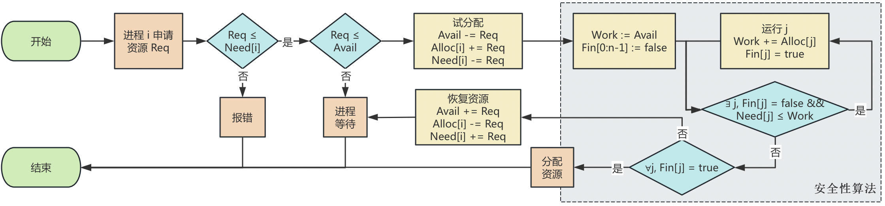
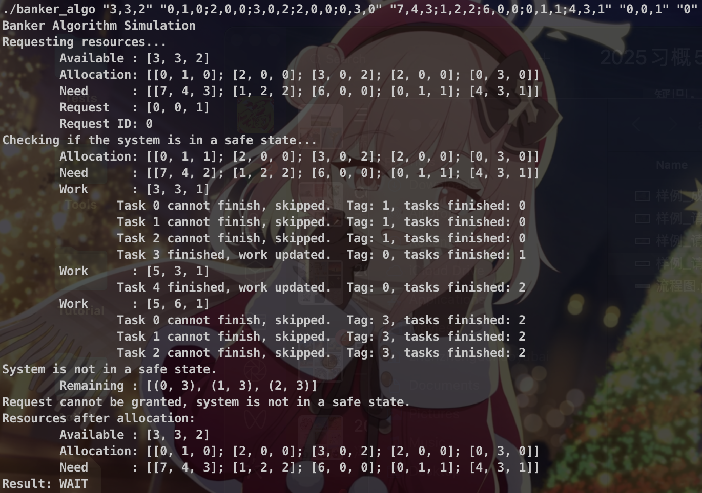

## 实验 4：处理机调度 —— 银行家算法

[TOC]


### 问题描述

银行家算法是避免死锁的一种重要方法，将操作系统视为银行家，操作系统管理的资源视为银行家管理的资金，进程向操作系统请求分配资源即企业向银行申请贷款的过程。

请根据银行家算法的思想，编写程序模拟实现动态资源分配，并能够有效避免死锁的发生。

### 实验环境

本实验在 `aarch64` 平台的 `Ubuntu 24.04 LTS` 操作系统上进行，编程语言采用 `C++ 17`，构建工具采用 `GNU Make 4.3`。

### 算法原理

银行家算法用于避免资源分配时的死锁。算法原理如下：

在系统运行过程中，对进程提出的每一个资源申请，首先检查是否能够被系统满足。若申请资源超出系统能分配的剩余资源，或申请资源超出其需要的最大资源，则拒绝该申请。否则，系统假装分配资源，并进行安全性检查，根据检查结果决定实际是否分配资源。若分配后系统可能发生死锁，则不予分配，否则予以分配

安全性算法的原理是，查找所需资源少于系统剩余资源的进程，并将所需资源分配给该进程，使其能够顺利运行完毕并归还资源。此过程中系统剩余资源保持不减。重复上述过程（查找、分配、运行、归还）。若所有进程均可以此方式顺利得到资源并运行完毕，则认为系统处于安全状态；否则，产生死锁，为不安全状态。

### 算法流程



### 关键代码

#### 数据结构

1. 用 `std::vector<int>` 储存向量（索引表示资源），用 `std::vector<std::vector<int>>` 储存矩阵（行索引表示进程，列索引表示资源）

2. 数据输入，定义如下函数

   ```c++
   std::vector<int> parseVector(const std::string& str);
   std::vector<std::vector<int>> parseMatrix(const std::string& str);
   ```

   用于将字符串转化为向量或矩阵。字符串用逗号 `,` 分隔相邻元素，用分号 `;` 分隔隔行元素。例如，`parseVector("1,2,3")` 返回向量 $\begin{bmatrix}1&2&3\end{bmatrix}$ 的表示，`parseMatrix("1,2;3,4")` 返回矩阵 $\begin{bmatrix}1&2\\3&4\end{bmatrix}$ 的表示

3. 数据可视化，重载了 `<<` 运算符

   ```c++
   template <typename T>
   std::ostream& operator<<(std::ostream& os, const std::vector<T>& vec);
   template <typename T>
   std::ostream& operator<<(std::ostream& os, const std::vector<std::vector<T>>& matrix);
   template<typename A, typename B>
   std::ostream& operator<<(std::ostream& os, const std::pair<A, B>& p);
   template <typename T>
   std::ostream& operator<<(std::ostream& os, const std::queue<T>& q)
   ```

   分别用于打印 `std::vector<T>`，`std::vector<std::vector<T>>`，`std::pair<A, B>` 及 `std::queue<T>`。用中括号 `[]` 表示向量或矩阵，小括号 `() ` 表示二元元组 `std::pair`，例如向量 $[1,~2,~3]$，矩阵 $[[1,~2];~[3,~4]]$，元组 $(1,~2)$

4. 数据运算，重载了 `+=`，`-=` 运算符

   ```c++
   template <typename T>
   std::vector<T>& operator+=(std::vector<T>& v1, const std::vector<T>& v2);
   template <typename T>
   std::vector<T>& operator-=(std::vector<T>& v1, const std::vector<T>& v2);
   ```

5. 数据比较，重载了 `>=`，`<=` 运算符

   ```c++
   template <typename T>
   bool operator>=(const std::vector<T>& v1, const std::vector<T>& v2);
   template <typename T>
   bool operator<=(const std::vector<T>& v1, const std::vector<T>& v2);
   ```

   注意这里比较的逻辑是，若 `v1` 的所有元素均不小于 `v2` 的对应元素，则称 `v1>=v2`，等价于 `all(v1>=v2)`。`<=` 类似

6. 以上函数的实现位于 `utils.hpp`

#### 银行家算法

声明如下

```c++
result banker_allocate(
    std::vector<int>& available,
    std::vector<std::vector<int>>& allocation,
    std::vector<std::vector<int>>& need,
    const std::vector<int>& request,
    int request_id
)
```

参数包括

- `available`：系统剩余资源
- `allocation`：每个进程的已分配资源
- `need`：每个进程的剩余所需资源
- `request`：进程请求的资源
- `request_id`：请求资源的进程 ID

返回值 `result`：

```c++
enum class result {
    FAIL    = 0,  // Request exceeds need.
    WAIT    = 1,  // Request exceeds available resources OR system is not in a safe state.
    SUCCESS = 2   // Request granted OR no resources requested.
};
```

算法实现如下

```c++
{
    if (request.empty()) {
        DEBUG_PRINT("No resources requested.");
        return result::SUCCESS;
    }
    if (!(request <= need[request_id])) {
        DEBUG_PRINT("Request exceeds need.");
        return result::FAIL;
    }
    if (!(request <= available)) {
        DEBUG_PRINT("Request exceeds available resources.");
        return result::WAIT;
    }

    available -= request;
    allocation[request_id] += request;
    need[request_id] -= request;

    if (!is_safe(available, allocation, need)) {
        available += request;
        allocation[request_id] -= request;
        need[request_id] += request;
        DEBUG_PRINT("Request cannot be granted, system is not in a safe state.");
        return result::WAIT;
    }

    DEBUG_PRINT("Request granted.");
    return result::SUCCESS;
}
```

其中，`is_safe` 为安全性算法

#### 安全性算法

声明如下

```c++
bool is_safe(
    const std::vector<int> available,
    const std::vector<std::vector<int>> allocation,
    const std::vector<std::vector<int>> need
);
```

参数包括

- `available`：系统剩余资源
- `allocation`：每个进程的已分配资源
- `need`：每个进程的剩余所需资源

算法实现如下

```c++
{
    DEBUG_PRINT("Checking if the system is in a safe state...");

    std::vector<int> work = available;
    std::queue<std::pair<int, int>> unfinished;
    for (std::size_t i = 0; i < allocation.size(); ++i) {
        unfinished.push(std::make_pair(i, 0));
    }
    DEBUG_PRINT("\tAllocation: " << allocation);
    DEBUG_PRINT("\tNeed      : " << need);
    DEBUG_PRINT("\tWork      : " << available);

    int task_count = 0;
    while (!unfinished.empty()) {
        int id = unfinished.front().first;
        int count = unfinished.front().second;
        if (task_count < count) {
            DEBUG_PRINT("System is not in a safe state.");
            DEBUG_PRINT("\tRemaining : " << unfinished);
            return false;
        }
        unfinished.pop();

        if (need[id] <= work) {
            work += allocation[id];
            ++task_count;
            DEBUG_PRINT("\t\tTask " << id << " finished, work updated. \tTag: " << count << ",\ttasks finished: " << task_count);
            DEBUG_PRINT("\tWork      : " << work);
        } else {
            unfinished.push(std::make_pair(id, task_count + 1));
            DEBUG_PRINT("\t\tTask " << id << " cannot finish, skipped. \tTag: " << task_count + 1 << ",\ttasks finished: " << task_count);
        }
    }

    DEBUG_PRINT("System is in a safe state.");
    return true;
}
```

这里利用循环队列 `unfinished` 替代了 `finish` 数组以避免重复遍历查找未完成运行的进程，优化了时间复杂度。对每个未完成的进程，记录了最近一次试分配时已完成的进程数 `task_count` +1 作为 `tag`，同进程 ID 一起存放于 `unfinished` 队列。即，每次取出队列头部的进程，若进程分配并运行成功，则将该进程移除队列，并使得 `task_count` 增加 1。若分配失败，则更新进程对应的 `id` 为 `task_count+1`，并将该进程移到队列尾。注意到，当前已完成的进程 `task_count`  小于取出的进程 `id` 时，表明该进程及之后的进程已在同一个 `work` 下进行第二次试分配，出现死锁，不安全。反之，若 `unfinished` 队列为空，表明所有进程均可完成分配，安全

#### 打印调试

定义宏 `DEBUG_PRINT(x)` 用于在 debug 模式下打印详细运行信息，同时利用互斥锁保证多线程下输出不串行

```c++
#ifdef DEBUG
std::mutex mutex_debug;
#define DEBUG_PRINT(x) \
    do { std::lock_guard<std::mutex> lk(mutex_debug); std::cout << x << std::endl; } while(0)
#else
#define DEBUG_PRINT(x) do {} while(0)
#endif
```

### 测试用例

1. 成功分配
   $$
   Allocation = \begin{bmatrix} 0&1&0\\2&0&0\\3&0&2\\2&1&1\\0&0&2\end{bmatrix},~
   Need = \begin{bmatrix} 7&4&3\\1&2&2\\6&0&0\\0&1&1\\4&3&1\end{bmatrix} \\
   Available = \begin{bmatrix} 3&3&2\end{bmatrix},~
   Request=\begin{bmatrix} 1&0&2\end{bmatrix},~
   Id=1
   $$
   将资源试分配给进程 1 后，矩阵成为
   $$
   Allocation = \begin{bmatrix} 0&1&0\\3&0&2\\3&0&2\\2&1&1\\0&0&2\end{bmatrix},~
   Need = \begin{bmatrix} 7&4&3\\0&2&0\\6&0&0\\0&1&1\\4&3&1\end{bmatrix} \\
   Available = \begin{bmatrix} 2&3&0\end{bmatrix}
   $$
   执行安全性算法，可能的序列为：$1\to3\to4\to0\to2$，为安全状态，分配成功

2. 请求资源超出最大需求
   $$
   Request=\begin{bmatrix} 0&0&2\end{bmatrix},~
   Id=3
   $$
   其余向量或矩阵同成功分配的样例

   由于进程 $Need_3 = \begin{bmatrix} 0&1&1\end{bmatrix}$，而 $Request_3=\begin{bmatrix} 0&0&2\end{bmatrix}$，申请大于实际需求，应拒绝

3. 请求资源超出可用资源
   $$
   Request=\begin{bmatrix} 4&3&1\end{bmatrix},~
   Id=4
   $$
   其余向量或矩阵同成功分配的样例

   由于进程 $Available = \begin{bmatrix} 3&3&2\end{bmatrix}$，而 $Request_4=\begin{bmatrix} 4&3&1\end{bmatrix}$，申请多于可用资源，应等待

4. 请求资源后导致死锁
   $$
   Allocation = \begin{bmatrix} 0&1&0\\2&0&0\\3&0&2\\2&0&0\\0&3&0\end{bmatrix},~
   Need = \begin{bmatrix} 7&4&3\\1&2&2\\6&0&0\\0&1&1\\4&3&1\end{bmatrix} \\
   Available = \begin{bmatrix} 3&3&2\end{bmatrix},~
   Request=\begin{bmatrix} 0&0&1\end{bmatrix},~
   Id=0
   $$
   原数据存在安全序列 $1\to3\to4\to2\to0$

   但将资源试分配给进程 0 后，矩阵成为
   $$
   Allocation = \begin{bmatrix} 0&1&1\\2&0&0\\3&0&2\\2&0&0\\0&3&0\end{bmatrix},~
   Need = \begin{bmatrix} 7&4&2\\1&2&2\\6&0&0\\0&1&1\\4&3&1\end{bmatrix} \\
   Available = \begin{bmatrix} 3&3&1\end{bmatrix}
   $$
   执行安全性算法，序列只能是 $3\to4$，此时剩余资源 $Available = \begin{bmatrix} 5&6&1\end{bmatrix}$，无法完成进程 0 或 1 或 2 的请求，产生死锁，应等待

### 测试运行

测试用例已记录于 `Makefile`，运行 `make` 即可完成编译、运行，模拟资源分配。运行 `make debug` 可得到详细输出信息。

1. 成功分配

   

   运行时，首先打印了输入的向量与矩阵。

   接着对申请的资源进行试分配，执行安全性算法，打印 `Allocation`，`Need`，`Work`（剩余资源）

   每当进程成功分配、释放资源时，打印更新的 `work`，该进程的 `tag`（含义见关键代码-安全性算法章节），已完成的进程数。例如：

   ```txt
   Task 1 finished, work updated. Tag: 0, tasks finished: 1
   work: [5, 3, 2]
   ```

   每当进程资源分配失败时，打印该进程更新的 `tag`（应为 `task finished + 1`），已完成的进程数。`work` 不变。例如：

   ```txt
   Task 0 cannot finish, skipped. Tag: 1, tasks finished:
   ```

   可见，找到了安全序列 $1\to3\to4\to0\to2$，且分配后的系统资源占用和分配情况均符合预期

2. 请求资源超出最大需求

   

   可见，运行结果符合预期，且系统资源占用和分配情况不变

3. 请求资源超出可用资源

   

   可见，运行结果符合预期，且系统资源占用和分配情况不变

4. 请求资源后导致死锁

   

   可见，在找到序列 $3\to4$ 后，剩余进程均无法分配资源，产生死锁。之后打印了剩余死锁进程及对应当前 `tag`，例如

   ```txt
   Remaining : [(0, 3), (1, 3), (2, 3)]
   ```

   运行结果符合预期，且系统资源占用和分配情况不变

### 算法评价

#### 鲁棒性

在合法的输入下，算法是鲁棒的，能够处理不同的情况。为了提高非法输入下的鲁棒性，一方面，在不合法的运算下会抛出异常。例如向量相加，若维度不匹配则抛出异常：

```c++
template <typename T>
std::vector<T>& operator+=(std::vector<T>& v1, const std::vector<T>& v2) {
    if (v1.size() != v2.size()) {
        throw std::invalid_argument("Vectors must be of the same size");
    }
    for (std::size_t i = 0; i < v1.size(); ++i) {
        v1[i] += v2[i];
    }
    return v1;
}
```

另一方面，在尝试分配资源前会检查输入数据的合法性，例如向量、矩阵的维度是否匹配，请求进程 ID 是否存在等。具体实现详见 `banker_algo::check_input`

此外当进程数为 0 时，此时请求进程 ID 必然不存在，会抛出异常；当请求的资源数为 0 时，则认为成功分配，并无需对资源做任何操作。

#### 效率

算法中，有且仅有安全性算法复杂度不是常数，故效率取决于安全性算法。假设进程数为 $n$，资源数为 $m$

在最坏的情况下，每次成功分配并释放一个进程的资源后，下一个可以分配资源的进程总是队列中该进程的前一个进程。由于采用循环队列，此进程在下一次遍历结束时才会被尝试分配。最坏复杂度为 $O(mn^2)$

而在最好的情况下，每次成功分配并释放一个进程的资源后，下一个可以分配资源的进程总是队列中该进程的后一个进程。由于采用循环队列，此进程立即被尝试分配。最优复杂度为 $O(mn)$

若不使用循环队列，由于需要重复遍历数组，复杂度为 $O(mn^2)$，是采用循环队列优化的最坏情况。事实上，最坏情况出现的条件极为苛刻，故大大提高了算法的效率。

### 实验心得

在本次实验中，我独立实现了银行家算法，掌握了其在系统资源分配中避免死锁的基本原理与具体操作流程。通过实际编程，不仅巩固了课堂所学理论知识，也提升了自己的动手能力和问题解决能力。尽管实验过程中曾遇到一些调试难题，但在查阅资料并认真分析后均得以顺利解决，使我在实践中积累了宝贵经验。衷心感谢老师在课堂上的深入讲解，以及助教在实验设计和指导中的细致付出，他们的努力为我顺利完成实验提供了有力支持，也让我收获颇丰。

### 思考题

Q：银行家算法在实现过程中需注意资源分配的哪些事项才能避免死锁？

A：第一，初始状态是安全的状态（这点包含在第四点）；第二，进程申请的资源数不能超过需求数；第三，申请的资源数不能超过可分配资源总数；第四，分配资源后，系统仍处于安全状态。
