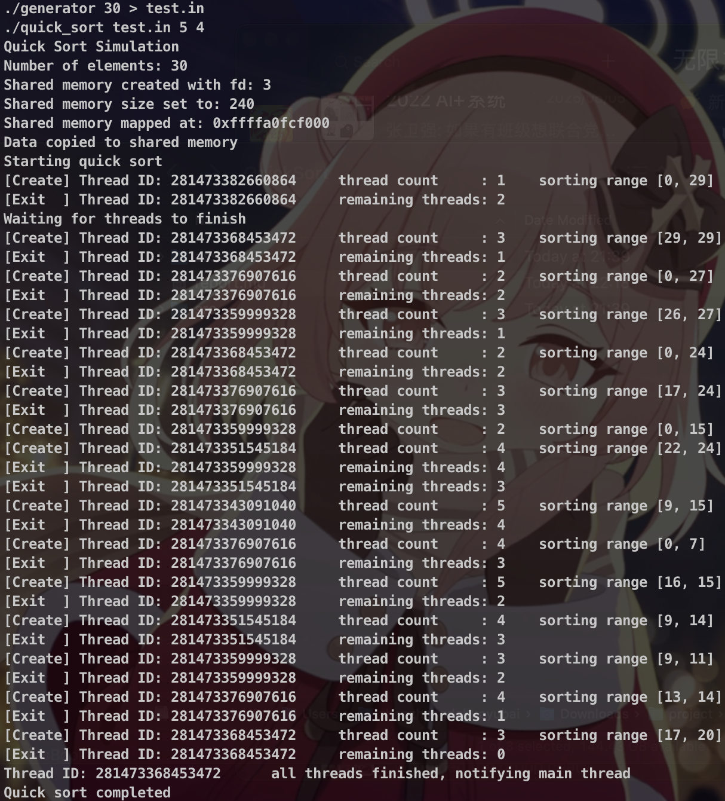

## 实验 2：高级进程间通信问题 —— 快速排序问题

[TOC]


### 问题描述

对于有 1,000,000 个乱序数据的数据文件执行快速排序

### 实验环境

本实验在 `aarch64` 平台的 `Ubuntu 24.04 LTS` 操作系统上进行，编程语言采用 `C++ 17`，构建工具采用 `GNU Make 4.3`

### 实验原理

本实验基于快速排序算法，采用多线程技术与共享内存机制，实现对包含 1,000,000 个乱序浮点数的数据文件的高效并行排序

实验采用 POSIX 共享内存机制（`shm_open`、`mmap` 等）创建多个线程间共享的数据区域，线程之间通过共享内存访问同一份数组数据，避免了多份数据副本带来的内存浪费和同步复杂度

### 算法设计

选择采用共享内存机制实现进程间通信

为了控制线程数目并防止线程过多导致资源争用，实验通过全局 `std::atomic<int> thread_count` 原子变量记录当前活跃线程数，并限制最大线程数 `MAX_THREADS`，当线程数达到设定上限时，后续的快速排序调用将以递归方式在当前线程中顺序执行，而不会再创建新线程

线程之间的同步通过 POSIX 信号量 `sem_t` 实现。当排序任务全部完成后，最后一个线程通过调用 `sem_post` 通知主线程继续执行。主线程则通过 `sem_wait` 阻塞等待所有排序线程完成，确保输出数据时已全部排好序

线程的创建使用 C++ 标准库中的 `std::thread`，线程互斥输出调试信息（在定义 `DEBUG` 宏时启用）则通过 `std::mutex` 和 `std::lock_guard` 实现。排序过程中，数据分区较小时改用插入排序，以减少线程开销并优化小规模排序性能

### 关键代码

#### 共享内存

1. 创建共享内存

   ```c++
   const char* shm_name = "/quick_sort_shm";
   int shm_fd = shm_open(shm_name, O_CREAT | O_RDWR, 0666);
   if (shm_fd < 0) {
       std::cerr << "Failed to open shared memory" << std::endl;
       return 1;
   }
   DEBUG_PRINT("Shared memory created with fd: " << shm_fd);
   ```

   使用 `shm_open` 创建一个 POSIX 命名共享内存区域，供多个线程或进程访问

2. 配置共享内存大小

   ```c++
   std::size_t shm_bytes = total_size * sizeof(double);
   if (ftruncate(shm_fd, shm_bytes) != 0) {
       std::cerr << "Failed to set size of shared memory" << std::endl;
       return 1;
   }
   DEBUG_PRINT("Shared memory size set to: " << shm_bytes);
   ```

   通过 `ftruncate` 设置共享内存对象的大小，以适应要存储的数据总字节数

3. 将共享内存映射到虚拟地址空间

   ```c++
   shared_arr = static_cast<double*>(mmap(nullptr, shm_bytes, PROT_READ | PROT_WRITE, MAP_SHARED, shm_fd, 0));
   if (shared_arr == MAP_FAILED) {
       std::cerr << "Failed to map shared memory" << std::endl;
       return 1;
   }
   DEBUG_PRINT("Shared memory mapped at: " << shared_arr);
   ```

   使用 `mmap` 将共享内存文件描述符映射到当前进程的虚拟地址空间中，实现数据共享

4. 拷贝数据到共享内存

   ```c++
   std::memcpy(shared_arr, data.data(), shm_bytes);
   DEBUG_PRINT("Data copied to shared memory");
   ```

   使用 `memcpy` 将读取的输入数据从本地容器复制到共享内存区域，供后续线程排序使用

5. 释放共享内存资源

   ```c++
   munmap(shared_arr, shm_bytes);
   close(shm_fd);
   shm_unlink(shm_name);
   DEBUG_PRINT("Shared memory unlinked and cleaned up");
   ```

   排序完成后，使用 `munmap` 解除内存映射，`close` 关闭文件描述符，`shm_unlink` 删除共享内存对象，确保资源正确释放并避免内存泄漏

#### 线程管理

线程函数作为排序线程的入口点，负责调用具体的快速排序函数，并在排序结束后减少线程计数。具体代码如下：

```c++
void quick_sort_thread(std::size_t low, std::size_t high, int n_threads = 1) {
    DEBUG_PRINT("[Create] Thread ID: " << std::this_thread::get_id() << "\tthread count     : " << n_threads << "\tsorting range [" << low << ", " << high << "]");
    quick_sort(low, high);
    const int past_thread_count = thread_count.fetch_sub(1);
    DEBUG_PRINT("[Exit  ] Thread ID: " << std::this_thread::get_id() << "\tremaining threads: " << past_thread_count - 1);
    if (past_thread_count == 1) {
        DEBUG_PRINT("Thread ID: " << std::this_thread::get_id() << "\tall threads finished, notifying main thread");
        sem_post(&mutex_thread);
    }
}
```

其中，信号量 `mutex_thread`，用于主线程与所有排序线程之间的同步控制。工作流程如下：

- 主线程在启动初始排序线程后立即调用 `sem_wait(&mutex_thread)` 进入阻塞状态
- 创建新线程时，使用 `thread_count.fetch_add(1)` 增加全局线程计数（初始值为 1）
- 每个线程在完成自己的排序任务后，使用 `thread_count.fetch_sub(1)` 减少全局线程计数
- 当最后一个线程检测到其为“最后退出的线程”（即 `thread_count` 递减后变为 0），调用 `sem_post(&mutex_thread)` 唤醒主线程

注意到 `thread_count.fetch_add` 与 `thread_count.fetch_sub` 均为原子操作，且返回值为操作之前的值

#### 快速排序

核心排序逻辑为快速排序算法，实现如下：

```c++
void quick_sort(std::size_t low, std::size_t high) {
    if (low >= high) return;
    std::size_t size = high - low + 1;
    if (size < CUTOFF) {
        insertion_sort(low, high);
        return;
    }
    std::size_t pivot_index = partition(low, high);
    if (thread_count.load() >= MAX_THREADS) {
        quick_sort(low, pivot_index == 0 ? 0 : pivot_index - 1);
        quick_sort(pivot_index + 1, high);
    } else {
        std::thread left_thread(quick_sort_thread, low, pivot_index == 0 ? 0 : pivot_index - 1, thread_count.fetch_add(1) + 1);
        std::thread right_thread(quick_sort_thread, pivot_index + 1, high, thread_count.fetch_add(1) + 1);
        left_thread.detach();
        right_thread.detach();
    }
}
```

为提高效率并限制线程数，对数据进行分区后，若数据块大小小于 `CUTOFF` 阈值，则采用插入排序以提高小数据量时的效率。若当前线程数已达到上限，则在当前线程中继续递归排序。否则并发创建两个新线程分别处理左右子区间，通过 `std::thread::detach` 将其设置为后台线程，同时增加全局线程计数。实际最大线程数可能会多于限制的上限，但不会偏离太多

`partition` 为快速排序的分区函数，负责将数据划分为小于和大于基准值的两个部分，并返回基准值的最终位置。具体实现如下：

```c++
std::size_t partition(std::size_t low, std::size_t high) {
    double pivot = shared_arr[high];
    std::size_t i = low;
    for (std::size_t j = low; j < high; ++j) {
        if (shared_arr[j] < pivot) {
            std::swap(shared_arr[i], shared_arr[j]);
            ++i;
        }
    }
    std::swap(shared_arr[i], shared_arr[high]);
    return i;
}
```

#### 插入排序

插入排序函数实现如下：

```c++
void insertion_sort(std::size_t low, std::size_t high) {
    for (std::size_t i = low + 1; i <= high; ++i) {
        double key = shared_arr[i];
        std::size_t j = i;
        while (j > low && shared_arr[j - 1] > key) {
            shared_arr[j] = shared_arr[j - 1];
            --j;
        }
        shared_arr[j] = key;
    }
}
```


#### 打印调试

定义宏 `DEBUG_PRINT(x)` 用于在 debug 模式下打印详细运行信息，同时利用互斥锁保证多线程下输出不串行

```c++
#ifdef DEBUG
std::mutex mutex_debug;
#define DEBUG_PRINT(x) \
    do { std::lock_guard<std::mutex> lk(mutex_debug); std::cout << x << std::endl; } while(0)
#else
#define DEBUG_PRINT(x) do {} while(0)
#endif
```

### 测试用例

利用随机数生成器生成排序前的样例，分布为 0-1 的均匀分布，数据类型为 `double`，部分代码如下：

```c++
    std::random_device rd;
    std::mt19937_64 gen(rd());
    std::uniform_real_distribution<double> dist(0.0, 1.0);
    for (size_t i = 0; i < N; ++i) {
        double x = dist(gen);
        std::cout << x;
        if (i + 1 < N) std::cout << "\n";
    }
```

以上代码位于 `generator.cpp`，用法：

```bash
./generator <array_size>
```

### 测试运行

#### 仿真结果正确性判断

将排序后的数据与利用 `std::sort` 排序后的结果比较即可。由于浮点数存在精度误差，当误差小于 `1e-9` 即认为相等。部分代码如下：

```c++
const double EPSILON = 1e-9;
bool vectors_equal(const std::vector<double>& a, const std::vector<double>& b) {
    if (a.size() != b.size()) return false;
    for (size_t i = 0; i < a.size(); ++i) {
        if (std::fabs(a[i] - b[i]) > EPSILON) {
            return false;
        }
    }
    return true;
}
```

以上代码位于 `verify.cpp`，用法：

```bash
./verify <original_file> <sorted_file>
```

#### 测试运行

运行 `make` 即可完成编译、生成测试样例、仿真运行、正确性判断。运行 `make debug` 可运行默认测试样例并得到详细输出信息

1. 数据量为 30，插入排序阈值 `CUTOFF` 为 5，线程数限制 `MAX_THREADS` 为 4

   

   可见，运行过程符合预期，且最大线程数为 5（含主线程）。排序结果如下：

   ```txt
   0.0121683
   0.075387
   0.154871
   0.170065
   0.18874
   0.20172
   0.221426
   0.225008
   0.269543
   0.298437
   0.30194
   0.30478
   0.336496
   0.346049
   0.425683
   0.491503
   0.494948
   0.500823
   0.571092
   0.704817
   0.773234
   0.79541
   0.821142
   0.826431
   0.838282
   0.871153
   0.914767
   0.9627
   0.997177
   0.997802
   ```

   排序正确

2. 数据量为 1000000，插入排序阈值 `CUTOFF` 为 1000，线程数限制 `MAX_THREADS` 为 20

   

   可见排序正确。某次运行的测试数据与排序输出见 `test.in.bak` 与 `out.sim.bak`

### 实验心得

在本次实验中，我独立解决了快速排序问题，掌握了高级进程间通信的基本原理与具体操作流程。通过实际编程，不仅巩固了课堂所学理论知识，也提升了自己的动手能力和问题解决能力。尽管实验过程中曾遇到一些调试难题，但在查阅资料并认真分析后均得以顺利解决，使我在实践中积累了宝贵经验。衷心感谢老师在课堂上的深入讲解，以及助教在实验设计和指导中的细致付出，他们的努力为我顺利完成实验提供了有力支持，也让我收获颇丰。

### 思考题

Q：你采用了你选择的机制而不是另外的两种机制解决该问题，请解释你做出这种选择的理由

A：在管道、消息队列、共享内存三种 IPC 机制中，选择共享内存，原因在于：

1. 数据量大，拷贝开销敏感：快速排序过程中，每次分割后要将子区间的数据传递给新的进程；若使用管道或消息队列，则每次都需要在内核空间和用户空间之间复制数据，1,000,000 条记录分块传输会产生大量数据拷贝，开销显著。而共享内存是所有进程映射同一块内存区域，读写操作在用户空间完成，拷贝开销近乎于零
2. 并发访问与同步：共享内存可能会导致并发访问与同步问题。但在本题中，由于快速排序不同的进程访问的是共享内存中不同地址的内容，并且每个进程的操作相互独立，没有共享数据的竞争关系，故在访问共享内存时无需互斥或同步

Q：你认为另外的两种机制是否同样可以解决该问题？如果可以请给出你的思路；如果不能，请解释理由

1. 管道：理论可行，但不适合。思路：

   - 父进程将数据分割成子区间，并通过管道将这些子区间传递给子进程处理
   - 每个子进程读取管道中的数据，进行排序，并将结果写回到管道
   - 父进程接收所有子进程的结果，最终完成排序。

   缺点在于，对于大规模数据，管道需要不断地进行数据的内核与用户空间拷贝，效率较低；管道的容量有限，数据量大时可能会导致堵塞或需要额外处理

2. 消息队列：理论可行，但不适合。思路：

   - 父进程将数据分割成多个子区间，并将每个子区间封装成消息发送到消息队列中
   - 子进程从消息队列中取出子区间进行排序，并将排序后的结果返回到队列中
   - 父进程从队列中读取子进程的结果，合并并最终输出排序结果

   缺点在于，对于大规模数据，消息队列可能需要拆分消息，增加了开发复杂性
